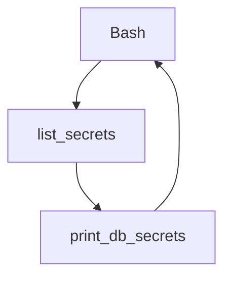

# CLI Scripts - `db-management`

## Instructions
- Script holder for database managementg related scripts.
- this script can be wrapped around to produce meaning full automated way.
  - ```for sec in `./list_secrets -s db` ; do ./print_secret -s ${sec} ; done```



## Individual Script Readme's

#### [list_secrets](./list_secrets)
- Environmental scopes are controlled using aws key.
- List all the secrets based on search term
##### Prequisites
- This script require aws key configured.
- This script also requires `python3` and `pip3 install boto3`
###### Sample Usage
- `./list_secerts` # List all secretes based on search provided, run to get the help.

#### [print_db_secrets](./print_secret)
- Environmental scopes are controlled using aws key.
- Print specific secret from the secret manager.
- For this script to print result, secret must contain `host`, `password`, `username` and `engine` value.
##### Prequisites
- This script require aws key configured.
- This script also requires `python3` and `pip3 install boto3`
###### Sample Usage
- `./print_secert` # Print secret from secretsmanager.
